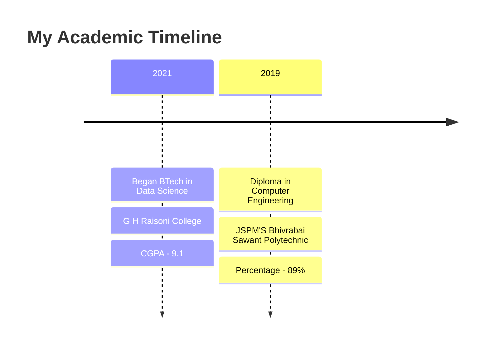

<!-- Header Animation -->

  <!-- Animated Welcome Text -->
  

  <!-- Analytics Woman SVG Banner -->
  <svg xmlns="http://www.w3.org/2000/svg" viewBox="0 0 800 100">
    <defs>
      <!-- Gradient for background -->
      <linearGradient id="grad1" x1="0%" y1="0%" x2="100%" y2="0%">
        <stop offset="0%" style="stop-color:#e6f3ff;stop-opacity:1" />
        <stop offset="100%" style="stop-color:#f0f7ff;stop-opacity:1" />
      </linearGradient>
      
      <!-- Gradient for data flow -->
      <linearGradient id="dataGrad" x1="0%" y1="0%" x2="100%" y2="0%">
        <stop offset="0%" style="stop-color:#2D9CDB;stop-opacity:1" />
        <stop offset="100%" style="stop-color:#56CCF2;stop-opacity:1" />
      </linearGradient>
    </defs>
    
    <!-- Background -->
    <rect width="800" height="100" fill="url(#grad1)"/>
    
    <!-- Woman figure -->
    <g transform="translate(100, 20)">
      <!-- Head -->
      <circle cx="25" cy="20" r="12" fill="#2D9CDB"/>
      <!-- Body -->
      <path d="M15,35 Q25,30 35,35 L35,60 L15,60 Z" fill="#2D9CDB"/>
      <!-- Arms -->
      <path d="M15,35 Q0,40 5,50" stroke="#2D9CDB" stroke-width="4" fill="none"/>
      <path d="M35,35 Q50,40 45,50" stroke="#2D9CDB" stroke-width="4" fill="none"/>
    </g>
    
    <!-- Floating Data Elements -->
    <g transform="translate(200, 0)">
      <!-- Data Flow Lines -->
      <path d="M0,50 Q200,20 400,50" stroke="url(#dataGrad)" stroke-width="2" fill="none">
        <animate attributeName="stroke-dasharray" from="0,1000" to="1000,0" dur="3s" repeatCount="indefinite"/>
      </path>
      <path d="M0,70 Q200,100 400,70" stroke="url(#dataGrad)" stroke-width="2" fill="none">
        <animate attributeName="stroke-dasharray" from="0,1000" to="1000,0" dur="3s" begin="1.5s" repeatCount="indefinite"/>
      </path>
      
      <!-- Data Points -->
      <g>
        <circle cx="50" cy="40" r="3" fill="#2D9CDB">
          <animate attributeName="opacity" values="0;1;0" dur="2s" repeatCount="indefinite"/>
        </circle>
        <circle cx="150" cy="30" r="3" fill="#2D9CDB">
          <animate attributeName="opacity" values="0;1;0" dur="2s" begin="0.5s" repeatCount="indefinite"/>
        </circle>
        <circle cx="250" cy="50" r="3" fill="#2D9CDB">
          <animate attributeName="opacity" values="0;1;0" dur="2s" begin="1s" repeatCount="indefinite"/>
        </circle>
        <circle cx="350" cy="40" r="3" fill="#2D9CDB">
          <animate attributeName="opacity" values="0;1;0" dur="2s" begin="1.5s" repeatCount="indefinite"/>
        </circle>
      </g>
    </g>
  </svg>

  <!-- Profile Views Counter -->
  

<!-- Introduction Section -->
## 👩‍💻 About Me

- 🎓 BTech in Data Science | G H Raisoni College
- 🔭 Currently working on **Large Language Models & GenAI**
- 🌱 Learning **MLOps & Deep Learning**
- 👯 Looking to collaborate on **AI/ML Projects**
- 💡 Always eager to learn new technologies
- 📫 Reach me at **yashfulsunder@gmail.com**
- ⚡ Fun fact: I debug with coffee ☕

<!-- Technology Stack -->
## 🚀 Tech Arsenal

  
  ### Languages & Frameworks
  
  
  
  
  
  
  ### Tools & Platforms
  
  
  
  
  

<!-- GitHub Stats -->
## 📊 GitHub Analytics

  
  

<!-- Streak Stats -->

  

<!-- Featured Projects -->
## 🌟 Featured Projects

  
  

<!-- Education Timeline -->
## 🎓 Education Journey

<!-- Achievements -->
## 🏆 Achievements & Certifications
- 📝 Published research paper in Springer
- 🥇 Winner of Code Vista 3.0 Hackathon
- 📜 AWS Certified Machine Learning Specialist
- 🌟 Python Bootcamp Certification
- 🎯 Top performer in college technical symposium

<!-- Connect Section -->
## 🤝 Let's Connect!

  
  
  
  

<!-- Contribution Graph -->
## 📈 Contribution Graph

<!-- Footer -->

  

