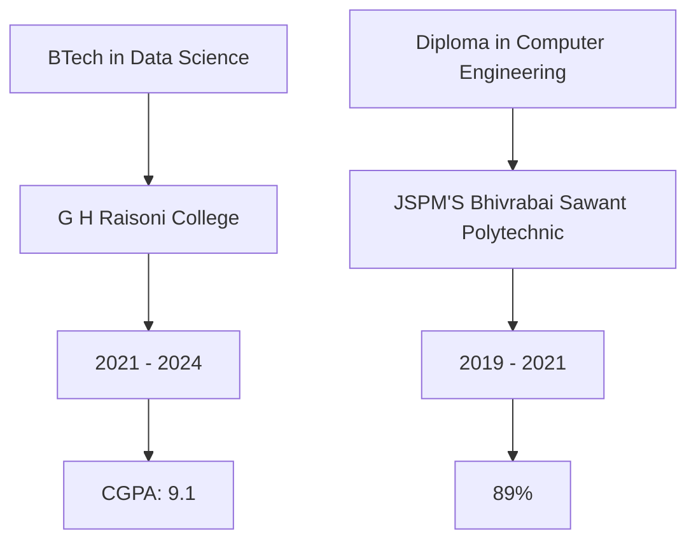

<!-- Header Animation & Image -->
Updated GitHub Profile Header

<!-- Header Animation & Image -->

  

  <!-- Data Scientist Banner -->
  <svg xmlns="http://www.w3.org/2000/svg" viewBox="0 0 800 60">
    <!-- Background -->
    <rect width="800" height="60" fill="#f8f9fa"/>
    
    <!-- Neural Network Nodes -->
    <circle cx="650" cy="30" r="4" fill="#2D9CDB">
      <animate attributeName="opacity" values="0.3;1;0.3" dur="2s" repeatCount="indefinite"/>
    </circle>
    <circle cx="680" cy="20" r="4" fill="#2D9CDB">
      <animate attributeName="opacity" values="0.3;1;0.3" dur="2s" begin="0.3s" repeatCount="indefinite"/>
    </circle>
    <circle cx="680" cy="40" r="4" fill="#2D9CDB">
      <animate attributeName="opacity" values="0.3;1;0.3" dur="2s" begin="0.6s" repeatCount="indefinite"/>
    </circle>
    <circle cx="710" cy="30" r="4" fill="#2D9CDB">
      <animate attributeName="opacity" values="0.3;1;0.3" dur="2s" begin="0.9s" repeatCount="indefinite"/>
    </circle>
    
    <!-- Connection Lines -->
    <line x1="650" y1="30" x2="680" y2="20" stroke="#2D9CDB" stroke-width="1">
      <animate attributeName="opacity" values="0.3;1;0.3" dur="2s" repeatCount="indefinite"/>
    </line>
    <line x1="650" y1="30" x2="680" y2="40" stroke="#2D9CDB" stroke-width="1">
      <animate attributeName="opacity" values="0.3;1;0.3" dur="2s" begin="0.3s" repeatCount="indefinite"/>
    </line>
    <line x1="680" y1="20" x2="710" y2="30" stroke="#2D9CDB" stroke-width="1">
      <animate attributeName="opacity" values="0.3;1;0.3" dur="2s" begin="0.6s" repeatCount="indefinite"/>
    </line>
    <line x1="680" y1="40" x2="710" y2="30" stroke="#2D9CDB" stroke-width="1">
      <animate attributeName="opacity" values="0.3;1;0.3" dur="2s" begin="0.9s" repeatCount="indefinite"/>
    </line>
    
    <!-- Woman silhouette -->
    <path d="M100,45 C100,25 120,25 120,35 C120,15 140,15 140,35 L140,45" fill="#2D9CDB"/>
    <circle cx="120" cy="20" r="10" fill="#2D9CDB"/>
    
    <!-- Floating Data Points -->
    <g>
      <circle cx="160" cy="25" r="3" fill="#2D9CDB">
        <animate attributeName="cy" values="25;20;25" dur="3s" repeatCount="indefinite"/>
      </circle>
      <circle cx="180" cy="35" r="3" fill="#2D9CDB">
        <animate attributeName="cy" values="35;30;35" dur="3s" begin="0.5s" repeatCount="indefinite"/>
      </circle>
      <circle cx="200" cy="30" r="3" fill="#2D9CDB">
        <animate attributeName="cy" values="30;25;30" dur="3s" begin="1s" repeatCount="indefinite"/>
      </circle>
    </g>
  </svg>
  
  
  
  <!-- Data Scientist Banner (repeated at bottom) -->
  <svg xmlns="http://www.w3.org/2000/svg" viewBox="0 0 800 60">
    <!-- Background -->
    <rect width="800" height="60" fill="#f8f9fa"/>
    
    <!-- Neural Network Nodes -->
    <circle cx="650" cy="30" r="4" fill="#2D9CDB">
      <animate attributeName="opacity" values="0.3;1;0.3" dur="2s" repeatCount="indefinite"/>
    </circle>
    <circle cx="680" cy="20" r="4" fill="#2D9CDB">
      <animate attributeName="opacity" values="0.3;1;0.3" dur="2s" begin="0.3s" repeatCount="indefinite"/>
    </circle>
    <circle cx="680" cy="40" r="4" fill="#2D9CDB">
      <animate attributeName="opacity" values="0.3;1;0.3" dur="2s" begin="0.6s" repeatCount="indefinite"/>
    </circle>
    <circle cx="710" cy="30" r="4" fill="#2D9CDB">
      <animate attributeName="opacity" values="0.3;1;0.3" dur="2s" begin="0.9s" repeatCount="indefinite"/>
    </circle>
    
    <!-- Connection Lines -->
    <line x1="650" y1="30" x2="680" y2="20" stroke="#2D9CDB" stroke-width="1">
      <animate attributeName="opacity" values="0.3;1;0.3" dur="2s" repeatCount="indefinite"/>
    </line>
    <line x1="650" y1="30" x2="680" y2="40" stroke="#2D9CDB" stroke-width="1">
      <animate attributeName="opacity" values="0.3;1;0.3" dur="2s" begin="0.3s" repeatCount="indefinite"/>
    </line>
    <line x1="680" y1="20" x2="710" y2="30" stroke="#2D9CDB" stroke-width="1">
      <animate attributeName="opacity" values="0.3;1;0.3" dur="2s" begin="0.6s" repeatCount="indefinite"/>
    </line>
    <line x1="680" y1="40" x2="710" y2="30" stroke="#2D9CDB" stroke-width="1">
      <animate attributeName="opacity" values="0.3;1;0.3" dur="2s" begin="0.9s" repeatCount="indefinite"/>
    </line>
    
    <!-- Woman silhouette -->
    <path d="M100,45 C100,25 120,25 120,35 C120,15 140,15 140,35 L140,45" fill="#2D9CDB"/>
    <circle cx="120" cy="20" r="10" fill="#2D9CDB"/>
    
    <!-- Floating Data Points -->
    <g>
      <circle cx="160" cy="25" r="3" fill="#2D9CDB">
        <animate attributeName="cy" values="25;20;25" dur="3s" repeatCount="indefinite"/>
      </circle>
      <circle cx="180" cy="35" r="3" fill="#2D9CDB">
        <animate attributeName="cy" values="35;30;35" dur="3s" begin="0.5s" repeatCount="indefinite"/>
      </circle>
      <circle cx="200" cy="30" r="3" fill="#2D9CDB">
        <animate attributeName="cy" values="30;25;30" dur="3s" begin="1s" repeatCount="indefinite"/>
      </circle>
    </g>
  </svg>

<!-- Profile Views Counter -->

 
   

<!-- About Me Section -->
## 💫 About Me

  

- 🌱 Currently working on **LLMs and GenAI**
- 💬 Ask me about **AI, ML, Data Science, and Python**
- 📫 Reach me at **yashfulsunder@gmail.com**

<!-- Tech Stack Section with Animations -->
## 🚀 Tech Stack

  
  <!-- Programming Languages -->
  
  
  

  <!-- Frameworks & Tools -->
  
  
  

  <!-- AI/ML Tools -->
  
  

<!-- GitHub Stats with Animations -->
## 📊 GitHub Stats

  
  
  
  
  

<!-- Projects Section with Custom Cards -->
## 🛠️ Featured Projects

  
  

<!-- Education Section with Timeline -->
## 🎓 Education

  

<!-- Achievements Section with Custom Badges -->
## 🏆 Achievements

  
  
  

<!-- Connect Section with Animated Badges -->
## 🤝 Connect With Me

  
  
  

<!-- Activity Graph -->
## 📈 Contribution Graph

  

<!-- Snake Animation -->

  

